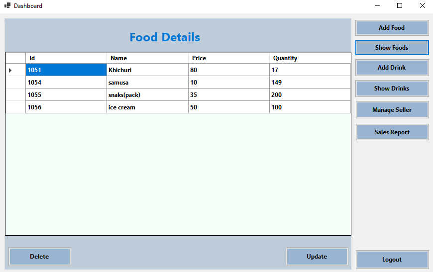

# Second-Year-University-Project-Using-C-
C# Desktop application for university project

# How to Open

Download the repository:

1. `git clone https://github.com/sohan-reza/Second-Year-University-Project-Using-Csharp.git`

2. `Go to the Project Directory and double click the `**Cafe.sln**` File`

# How to run

1. `Open the project directory and go to the  Cafe > bin > Debug > net6.0-windows folder and double click the `**Cafe**` program.`

2. `Or you can open it in Visual Studio and press the` **Cafe** `from top bar`

# Installed Package:

1. Newtonsoft.Json
2. System.Data.SqlClient

# Screenshots

